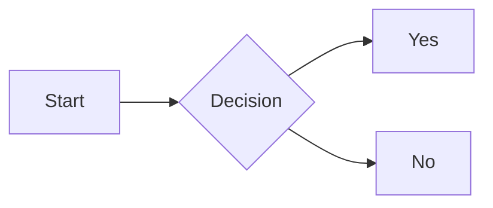

# mdview-cli

[](https://www.npmjs.com/package/mdview-cli)
[](https://opensource.org/licenses/MIT)
[](https://nodejs.org/)
    
Beautiful terminal Markdown viewer — syntax highlighting, tables, images, math, Mermaid diagrams, presentation mode, watch mode, and more.

## Install

```bash
npm install -g mdview-cli
```

## Usage

```bash
md README.md              # Render a Markdown file
md .                      # Browse Markdown files interactively
md ~/docs/                # Browse a directory
md README.md --watch      # Watch mode — re-render on save
md slides.md --present    # Presentation / slideshow mode
md --help                 # Show help
```

## Features

- **Full Markdown** — CommonMark + GFM: headings, paragraphs, bold/italic/strikethrough, inline code, links, images, blockquotes, horizontal rules
- **Syntax highlighting** — 30+ languages via highlight.js with language-specific colors
- **Tables** — GFM tables with box-drawing characters and proper alignment
- **Task lists** — Renders `- [x]` as ☑ and `- [ ]` as ☐
- **Clickable links** — OSC 8 terminal hyperlinks (iTerm2, WezTerm, Kitty, etc.)
- **Images** — Local and remote images rendered inline via terminal-image; ASCII fallback
- **Mermaid diagrams** — flowchart, sequence, pie, Gantt, class, state diagrams
- **Math / LaTeX** — Block `$$` and inline `$` math via Unicode (α β Σ ∫ x² etc.)
- **Watch mode** — Auto re-render when file is saved (`--watch`)
- **Presentation mode** — Use `---` as slide separator, navigate with arrow keys (`--present`)
- **Directory browser** — Interactive file picker with keyboard navigation (`md .`)
- **Shebang support** — Add `#!/usr/bin/env md` and `chmod +x notes.md`

## Shell Integration

Add this to your `~/.zshrc` or `~/.bashrc` to open `.md` files by just typing their name:

```bash
command_not_found_handler() {
  [[ "$1" == *.md ]] && [ -f "$1" ] && md "$1" && return 0
  return 127
}
```

After `source ~/.zshrc`, typing `README.md` opens it instantly.

## Shebang

Add `#!/usr/bin/env md` as the first line of any Markdown file:

```markdown
#!/usr/bin/env md
# My Doc

Content here...
```

Then:

```bash
chmod +x notes.md
./notes.md
```

## Presentation Mode

Use `---` as a slide separator:

```markdown
# Slide 1

Hello world

---

# Slide 2

Next slide
```

```bash
md slides.md --present
# ← → or Space/P to navigate, Q to quit
```

## Math Support

Inline: `$E = mc^2$` → E = mc²

Block:
```
$$
\int_a^b f(x)dx = F(b) - F(a)
$$
```

Supports: Greek letters (α β γ...), operators (∑ ∫ ∏), arrows (→ ⇒ ↔), superscripts/subscripts, fractions, and more.

## Mermaid



Supported: flowchart, sequenceDiagram, pie, gantt, classDiagram, stateDiagram.

## Requirements

- Node.js 18 or later

## License

MIT
