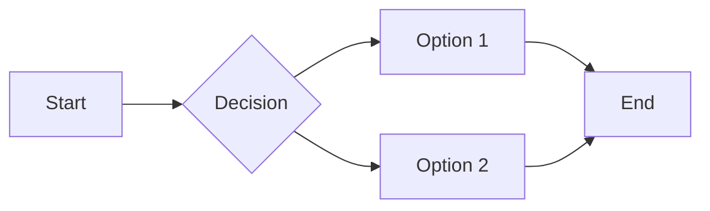

# Hello World

## Features

- Fast
- Beautiful
- Open Source

### Code Example

```javascript
const greet = (name) => {
  console.log(`Hello, ${name}!`);
};
greet("World");
```

### Table

| Name | Age | Role |
|------|-----|------|
| Alice | 30 | Engineer |
| Bob | 25 | Designer |
| Carol | 28 | PM |

### Tasks

- [x] Build the CLI
- [x] Add syntax highlighting
- [ ] Write docs
- [ ] Publish to npm

### Math

Inline: $E = mc^2$

Block:
$$
\int_a^b f(x)dx = F(b) - F(a)
$$

### Quote

> "The best tool is the one you actually use."

### Mermaid



### Link

[GitHub](https://github.com)

---

Done!
